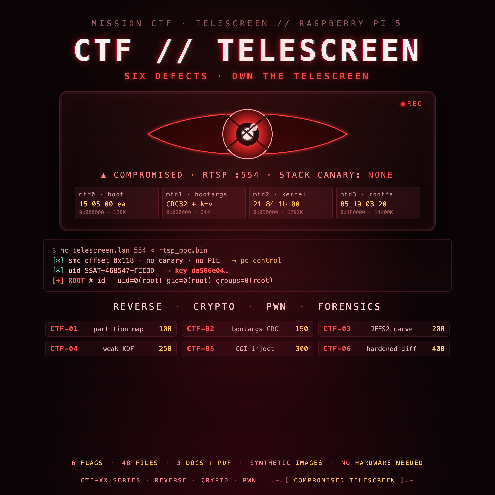

<br>

## FREE Reverse Engineering Self-Study Course [HERE](https://github.com/mytechnotalent/reverse-engineering)
## FREE Embedded Hacking Course [HERE](https://github.com/mytechnotalent/Embedded-Hacking)

<br>

# OPERATION TELESCREEN CTF

### The Compromised Surveillance Backbone
#### The finale after OPERATION COLD IRON

Capture the Flag XX - **The compromised surveillance node**

<br>

***
**LEGAL DISCLAIMER:**
The information, tools, and code provided in this repository and course are strictly for educational, research, and defensive purposes only. 

You are explicitly prohibited from using any materials contained herein to access, test, modify, or exploit any device, network, or system that you do not own 100% or for which you do not have explicit, documented, and legally binding authorization to interact with.

By using this repository and course, you acknowledge and agree that:

1. Any illegal, unauthorized, or malicious use of this information is solely your responsibility.
2. The author(s) and contributor(s) of this repository and course shall not be held liable for any damages, legal repercussions, criminal charges, or unauthorized actions resulting from the use, misuse, or abuse of the contents herein.
3. You will comply with all applicable local, state, national, and international laws regarding cybersecurity and computer fraud.

**IF YOU DO NOT AGREE WITH THESE TERMS, DO NOT USE THIS REPOSITORY AND COURSE.**
***

<br>
<br>

> Hello, friend.
>
> The wall unit swore the room had been quiet all night. No motion. No sound. Just a
> tidy little beacon every sixty seconds, humming off to a relay nobody in the building
> had ever heard of.
>
> Then we pulled the flash and read the four images the Ministry burned into it, and we
> stopped believing the little beacon.
>
> You have the images. You have a Raspberry Pi 5. What you do not have is time: the
> sweep reaches this block at dawn.

This is the companion capture-the-flag to the
[telescreen](https://github.com/mytechnotalent/telescreen) project. Where the project
builds the defended device, this CTF hands you the **compromised** device and asks you
to find every backdoor, prove it, and rebuild it hardened.

<br>

## WHERE THIS FITS

This CTF sits in the same world as OPERATION COLD IRON. The Ministry runs the
state - the surveillance, the cold chain, the gates, the pipelines - and against
it stands WHITEOUT. OPERATION COLD IRON is a planned **ten-act saga** (still in
development); the acts build the Ministry's industrial edge, starting with the
[cold-chain monitor](https://github.com/mytechnotalent/cold-chain-monitor).
**TELESCREEN is the surveillance backbone that watches it**, and this repository
is that backbone **captured and compromised** - the finale after OPERATION COLD
IRON. The whole saga is **ARM** - bare-metal Cortex-M33 in the acts,
application-class Cortex-A76 here.

| work | platform | role in the story |
| ---- | -------- | ----------------- |
| [OPERATION COLD IRON](https://github.com/mytechnotalent/cold-chain-monitor) | ARM Cortex-M33 (RP2350) | the Ministry's cold-chain edge - Act I (saga in development) |
| [telescreen](https://github.com/mytechnotalent/telescreen) | ARM Cortex-A76 (Raspberry Pi 5) | the defended surveillance backbone |
| **CTF_telescreen (this repo)** | **ARM Cortex-A76 (Raspberry Pi 5)** | **the same backbone, compromised** |

<br>

## THE MISSION

`CTF-XX-full.img` is the TELESCREEN node with deliberate defects and a poisoned
exfiltration channel. Carve the four partitions, reverse the boot chain, find the
backdoors, break the weak key derivation, and produce a hardened image.

| # | Backdoor | What the Ministry did |
|---|----------|-----------------------|
| B1 | Config-sourced root exec | sources a writable config as root |
| B2 | CGI command injection | builds a shell command from a request |
| B3 | Archive-to-root restore | `tar -xvzf <upload> -C /` as root |
| B4 | Empty / default credentials | ships with no web password |
| B5 | Debug root shell | leaves a local root path |
| B6 | Weak key schedule | derives the beacon key from the public UID |

<br>

## THE ARTIFACTS

```
CTF-XX-full.img          the whole 16 MiB image
CTF-XX-boot.img          partition 0 (U-Boot)
CTF-XX-env.img           partition 1 (U-Boot environment)
CTF-XX-kernel.img        partition 2 (vendor container -> Linux)
CTF-XX-rootfs.img        partition 3 (JFFS2)
CTF-XX-full_fixed.img    the hardened reference image
```

<br>

## THE CURRICULUM - every document in this repository

### Documents

| document | role |
| -------- | ---- |
| [CTF-XX-I.md](CTF-XX-I.md) / [.pdf](CTF-XX-I.pdf) | student instructions |
| [CTF-XX-R.md](CTF-XX-R.md) / [.pdf](CTF-XX-R.pdf) | requirements and grading |
| [CTF-XX-S.md](CTF-XX-S.md) / [.pdf](CTF-XX-S.pdf) | instructor solution key |
| [DESIGN.md](DESIGN.md) | the build spine (instructor-facing) |
| [PARTS.md](PARTS.md) | bill of materials |

### Reverse-engineering the node (stripped aarch64 binary)

| artefact | role |
| -------- | ---- |
| [firmware/README.md](firmware/README.md) | the stripped target and the answer key |
| [firmware/build_target.sh](firmware/build_target.sh) | builds the target (cross-platform, pinned container) |
| [ghidra/README.md](ghidra/README.md) | the Ghidra workspace |
| [ghidra/RESOLUTION_MAP.md](ghidra/RESOLUTION_MAP.md) | every function -> its real name + the proving rule |
| [ghidra/resolution.json](ghidra/resolution.json) | the resolution data, machine-readable |
| [CTF-XX-J-ghidra-function-resolution.md](CTF-XX-J-ghidra-function-resolution.md) | the per-function RE report (with call graphs and decompiled C) |
| [ctf/ctfnode.c](ctf/ctfnode.c) | the vulnerable source (instructors only) |
| [scripts/test_consistency.py](scripts/test_consistency.py) | regression: the compiled binary's key must equal the Python tool and the published vector (run by CI) |
| [scripts/test_defects.py](scripts/test_defects.py) | live defect harness: proves B1-B6 actually manifest (containerized, no hardware) |
| [ghidra/tests/test_resolution.py](ghidra/tests/test_resolution.py) | asserts the function-resolution invariants |

### Artifacts

```
CTF-XX-full.img          the whole 16 MiB image
CTF-XX-boot.img          partition 0 (U-Boot)
CTF-XX-env.img           partition 1 (U-Boot environment)
CTF-XX-kernel.img        partition 2 (vendor container -> Linux)
CTF-XX-rootfs.img        partition 3 (JFFS2)
CTF-XX-full_fixed.img    the hardened reference image
CTF-XX-main-disasm.txt   AArch64 disassembly of the integrity primitives
```

### Setup (Windows x64, Linux x64, macOS arm64)

Install Docker, the JDK 21, and Ghidra 12.1.3 using the companion course:
**`telescreen` → [docs/31-prerequisites-and-install.md](https://github.com/mytechnotalent/telescreen/blob/main/docs/31-prerequisites-and-install.md)**,
then the lab sheets
[docs/walkthrough/75](https://github.com/mytechnotalent/telescreen/blob/main/docs/walkthrough/75-prereqs-and-install.md),
[76](https://github.com/mytechnotalent/telescreen/blob/main/docs/walkthrough/76-ghidra-from-zero.md), and
[77](https://github.com/mytechnotalent/telescreen/blob/main/docs/walkthrough/77-function-resolution.md).

Working on real hardware? **[Walkthrough 78 - Raspberry Pi Bring-Up (Pi 4B and
Pi 5)](https://github.com/mytechnotalent/telescreen/blob/main/docs/walkthrough/78-raspberry-pi-bringup.md)**
flashes the card, configures it headless, wires the serial console, and brings up
the camera.

Want to work on a **real OpenWrt device** (the same OS family as a GL.iNet
Mango)? **[Walkthrough 79 - A Real OpenWrt Device on the Pi](https://github.com/mytechnotalent/telescreen/blob/main/docs/walkthrough/79-openwrt-real-device.md)**
turns the Pi into a genuine router you can practice on.

<br>

## RELATED

- Project: [telescreen](https://github.com/mytechnotalent/telescreen) - the defended lab
- Course: [Embedded Hacking](https://github.com/mytechnotalent/Embedded-Hacking)

<br>

# License
[MIT License](https://github.com/mytechnotalent/CTF_telescreen/blob/main/LICENSE)
